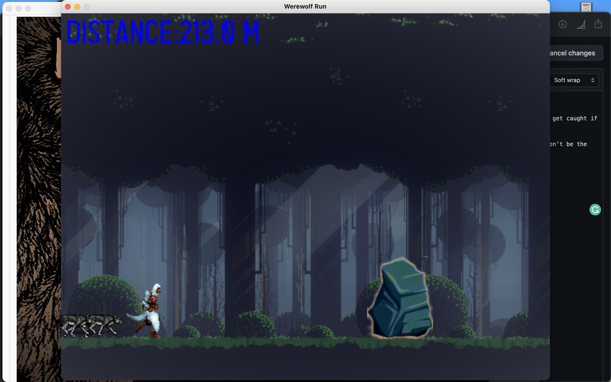

# _ **Werewolf Run** _

Werewolf Run is an arcade-action-running game where the user is chased by the wolf. Dodge the obstacles on your way and watch out for the wolf. Don’t get caught if you want to live. 

The speed of the player increases as he dodges more obstacles continuously. It’s a full moon night and the wolf is waiting to find some fresh meat. Don’t be the dinner. 

The main aim of the game is to keep running and dodging the obstacles on the way for as long as you can. 

**Tkinter** is used to make Main Menu and Toplevel Widget (End Menu), while **Pygame** is used to make the game.

